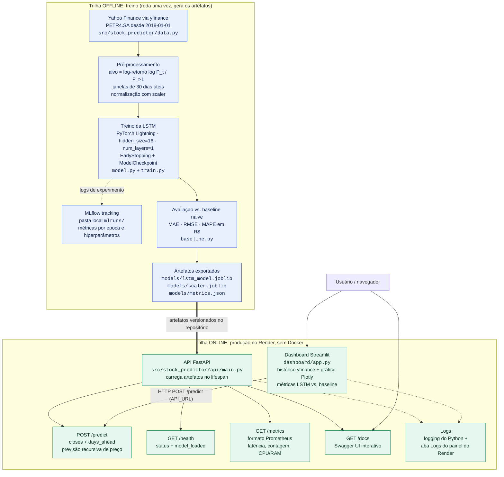

# Roteiro do Vídeo Demonstrativo: Tech Challenge Fase 4

Documento de apoio para a gravação do vídeo de entrega (duração máxima: **10 minutos**).

O foco principal do vídeo é **demonstrar o funcionamento da API** em produção. As etapas de
dados, treino e avaliação aparecem apenas como contexto rápido, apoiadas no diagrama abaixo.

---

## 1. Diagrama do fluxo do projeto

O projeto tem duas trilhas bem distintas:

- **Trilha offline (treino):** roda uma vez, produz os artefatos do modelo.
- **Trilha online (produção):** consome os artefatos já treinados; é o que roda no Render 24/7.



**URLs de produção usadas na demonstração:**

| Serviço | URL |
| --- | --- |
| API | https://lstm-stock-api-tj0s.onrender.com |
| Swagger da API | https://lstm-stock-api-tj0s.onrender.com/docs |
| Dashboard | https://lstm-stock-dashboard-ueg1.onrender.com |
| MLflow (local) | http://127.0.0.1:5000 |

---

## 2. Pauta do vídeo (orçamento de 10 minutos)

| # | Seção | Duração | Acumulado |
| --- | --- | --- | --- |
| 1 | Abertura e apresentação do problema | 0:30 | 0:30 |
| 2 | Pipeline: dados, treino e avaliação (com o diagrama) | 1:45 | 2:15 |
| 3 | **API ao vivo: Swagger, /predict, /health, /metrics** | 3:30 | 5:45 |
| 4 | **Dashboard ao vivo** | 2:00 | 7:45 |
| 5 | Deploy no Render e logs | 1:15 | 9:00 |
| 6 | MLflow (tracking de experimentos) | 0:40 | 9:40 |
| 7 | Fechamento | 0:20 | 10:00 |

> Total: **10:00**. As seções 3 e 4 somam 5:30, mais da metade do vídeo, como planejado.

---

### Seção 1: Abertura (0:00 a 0:30)

**O que dizer**

- Nome, curso (Pós-Tech FIAP, Machine Learning Engineering) e que este é o Tech Challenge da Fase 4.
- Em uma frase: "pipeline completo de deep learning que prevê o preço de fechamento da PETR4 com uma LSTM, servido por uma API REST e um dashboard, ambos em produção."
- Avisar o roteiro: "vou passar rápido pelo treino e gastar a maior parte do tempo mostrando a API e o dashboard funcionando de verdade."

**O que mostrar**

- Tela do README do repositório no GitHub (topo, com o título do projeto), ou um slide simples de capa.

---

### Seção 2: Pipeline de dados, treino e avaliação (0:30 a 2:15)

Seção de contexto. Ritmo rápido, sem entrar em código linha a linha.

**O que dizer**

- **Dados (~25s):** histórico da PETR4.SA baixado com `yfinance` desde 2018; janelas de 30 dias úteis como entrada.
- **Decisão de modelagem (~35s), vale destacar, é o ponto técnico mais forte:** o modelo **não prevê o preço bruto, prevê o log-retorno** `log(P_t / P_{t-1})`. Motivo: preço é uma série não-estacionária, e uma LSTM treinada direto no preço tende a simplesmente copiar o último valor observado, o que infla artificialmente as métricas. O preço só é reconstruído na saída, com `P_t = P_{t-1} * exp(retorno previsto)`.
- **Treino (~20s):** LSTM em PyTorch Lightning, `hidden_size=16`, `num_layers=1`, com `EarlyStopping` e `ModelCheckpoint`. Mencionar que a configuração começou maior (64 unidades, 2 camadas) e foi **reduzida** porque dava overfit e não superava a baseline.
- **Avaliação (~25s), manter o tom honesto:** comparação com uma **baseline naive de persistência** ("amanhã = hoje"), em MAE, RMSE e MAPE, na escala de preço em reais. O LSTM ganha nas três métricas, **mas por margem estreita: da ordem de 0,3% a 1,0% de melhora**. Dizer explicitamente: *"não rodei teste estatístico formal de significância, então não dá para afirmar que o modelo bate o mercado; esse resultado é consistente com a hipótese de mercado eficiente e está reportado assim mesmo no README."*
- Fechar apontando para os artefatos gerados: `lstm_model.joblib`, `scaler.joblib`, `metrics.json`.

**O que mostrar**

- O **diagrama Mermaid** deste documento (ou renderizado no GitHub), destacando com o cursor a trilha offline.
- Rapidamente, o `models/metrics.json` aberto no editor, mostrando os números reais lado a lado (LSTM vs. baseline).
- Opcional, se sobrar tempo: um scroll de 3 segundos em `src/stock_predictor/train.py`, sem ler o código.

---

### Seção 3: API ao vivo (2:15 a 5:45), parte principal

**Antes de gravar:** abrir a URL da API uns 2 minutos antes para "acordar" o serviço (plano free do Render hiberna após 15 min; cold start de 30 a 60s). Isso evita silêncio na gravação.

**3a. Visão geral da API (~30s)**

- *Dizer:* API em FastAPI; os artefatos do modelo são carregados uma única vez no `lifespan` da aplicação, com fallback degradado caso o carregamento falhe. O serviço sobe mesmo assim e reporta isso no `/health`.
- *Mostrar:* `https://lstm-stock-api-tj0s.onrender.com/docs` (Swagger UI), com a lista de endpoints visível.

**3b. `GET /health` (~20s)**

- *Dizer:* endpoint usado pelo health check do próprio Render; confirma que o serviço está de pé e que o modelo foi carregado.
- *Mostrar:* executar pelo Swagger ("Try it out" e "Execute") e apontar a resposta `{"status": "ok", "model_loaded": true}`.

**3c. `POST /predict`, o coração da demo (~1:40)**

- *Dizer:* o contrato de entrada: uma lista `closes` com os preços de fechamento (precisa ter no mínimo `sequence_length + 1` = 31 valores) e `days_ahead`, quantos dias úteis prever.
- *Dizer:* como funciona por dentro: normaliza, converte para log-retornos, roda a LSTM, e reconstrói o preço. Para múltiplos dias a previsão é **recursiva**, cada dia usa a previsão do dia anterior como entrada, então **o erro se acumula**; por isso o horizonte é curto (até 10 dias).
- *Mostrar:*
  1. No Swagger, expandir `POST /predict` e clicar em "Try it out".
  2. Colar um payload já preparado (deixar salvo em um bloco de notas para copiar e colar sem digitar no vídeo):
     ```json
     {
       "closes": [38.10, 38.42, 38.05, 37.88, 38.31, "... pelo menos 31 valores ..."],
       "days_ahead": 5
     }
     ```
  3. "Execute" e comentar a resposta com as 5 previsões de preço.
  4. Opcional (~15s), se o tempo estiver bom: mostrar um erro de validação, enviando `closes` com poucos elementos e mostrando o `422` com a mensagem explicando o mínimo exigido. É um bom ponto de robustez.

**3d. `GET /metrics` (~40s)**

- *Dizer:* endpoint no formato Prometheus, exposto via `prometheus-fastapi-instrumentator`: contagem e latência das requisições, mais gauges customizados de uso de CPU e RAM do processo (`api/monitoring.py`).
- *Dizer, com honestidade:* *"o endpoint está pronto para um Prometheus raspar, mas neste deploy não há um servidor Prometheus rodando; o que existe é a instrumentação exposta."*
- *Mostrar:* abrir `/metrics` no navegador e rolar até as métricas `http_request_*` e os gauges de CPU/RAM. Dá para voltar ao Swagger, disparar mais um `/predict` e recarregar `/metrics` para mostrar o contador subindo.

**3e. Fechamento da seção (~20s)**

- *Dizer:* a API é stateless e consome apenas os artefatos versionados; o dashboard é só mais um cliente dela.

---

### Seção 4: Dashboard ao vivo (5:45 a 7:45)

**Antes de gravar:** também acordar o dashboard com antecedência.

**O que dizer**

- O dashboard é um Streamlit separado, rodando como um segundo serviço no Render, e conversa com a API pela variável de ambiente `API_URL`.
- O fluxo: ele busca o histórico da PETR4 direto do `yfinance`, envia os fechamentos para o `POST /predict` da API e plota histórico e previsão num gráfico Plotly.
- Mencionar o tratamento de cold start: timeout de 60s na chamada e um `st.error` explicando ao usuário quando a API ainda está acordando, detalhe de UX que veio de uma limitação real do plano free.
- Ao mostrar as métricas na tela, **repetir o tom honesto**: o LSTM aparece melhor que a baseline naive nas três métricas, mas por uma margem pequena e sem teste de significância.

**O que mostrar**

1. Abrir `https://lstm-stock-dashboard-ueg1.onrender.com`.
2. Mover o **slider** de dias úteis (1 a 10) e clicar em **"Gerar previsão"**.
3. Comentar o **gráfico Plotly**: a linha do histórico e a linha da previsão emendando no último ponto real.
4. Rolar até o painel de **métricas LSTM vs. baseline naive** e comentar os números.
5. Opcional (~10s): repetir com outro valor no slider para mostrar que o horizonte muda de verdade.

---

### Seção 5: Deploy no Render e logs (7:45 a 9:00)

**O que dizer**

- Dois serviços web Python **nativos, sem Docker**, no Render, apontando para o repositório dedicado do projeto:
  - `lstm-stock-api`: `uvicorn stock_predictor.api.main:app --host 0.0.0.0 --port $PORT`, com health check configurado em `/health`.
  - `lstm-stock-dashboard`: `streamlit run dashboard/app.py --server.port $PORT --server.address 0.0.0.0`, com `API_URL` apontando para a URL pública da API.
- O `render.yaml` no repositório documenta essa configuração.
- Limitação assumida: plano free hiberna após 15 minutos de inatividade.
- **Sobre logs, ser preciso:** não há um agregador de logs externo. O que existe é, primeiro, o `logging` do Python na aplicação (por exemplo, um `logger.exception` se os artefatos do modelo falharem ao carregar) e, segundo, os logs de build e de runtime ao vivo no próprio painel do Render.

**O que mostrar**

1. Painel do Render com os **dois serviços** listados e status "Live".
2. Abrir o serviço `lstm-stock-api`, aba **Logs**, e apontar as linhas de inicialização do Uvicorn e as requisições que acabaram de ser feitas na Seção 3 (é bom que a demo da API venha antes, justamente para os logs já terem conteúdo).
3. Se sobrar tempo (~15s): mesma coisa na aba **Logs** do `lstm-stock-dashboard`.
4. Opcional: mostrar em 5 segundos a aba de variáveis de ambiente com `API_URL` configurada.

---

### Seção 6: MLflow (9:00 a 9:40)

Seção curta, só para comprovar que o tracking de experimentos existe.

**O que dizer**

- O treino é instrumentado com `mlflow.pytorch.autolog()`; o backend é local em arquivo, na pasta `mlruns/` do repositório.
- Cada execução registra hiperparâmetros e métricas de treino e validação por época. Foi assim que ficou evidente o overfit da configuração maior (64 unidades / 2 camadas), o que motivou a redução para 16 / 1.

**O que mostrar**

1. Terminal: `mlflow ui` (deixar já rodando antes da gravação para não esperar o boot).
2. Navegador em `http://127.0.0.1:5000`: lista de runs, entrar em uma run e mostrar a aba de **parâmetros** e um **gráfico de métrica por época** (loss de treino/validação).

---

### Seção 7: Fechamento (9:40 a 10:00)

**O que dizer**

- Recapitular em uma frase: coleta com `yfinance`, LSTM sobre log-retornos, avaliação contra baseline naive, API FastAPI, dashboard Streamlit, tudo em produção no Render, com monitoramento exposto.
- Repetir a conclusão honesta: ganho pequeno e sem significância estatística comprovada; o valor da entrega está no **pipeline de ponta a ponta em produção**, não em uma alegação de superar o mercado.
- Agradecer e encerrar.

**O que mostrar**

- O diagrama novamente, ou as duas URLs de produção lado a lado.

---

## 3. Checklist pré-gravação

- [ ] Acordar a **API** (`/health`) e o **dashboard** ~2 min antes de gravar, para evitar cold start no vídeo.
- [ ] `mlflow ui` já rodando em background, com o navegador na página de runs.
- [ ] Payload JSON do `/predict` (com **31+ valores** em `closes`) salvo em bloco de notas para copiar e colar.
- [ ] Abas do navegador pré-abertas na ordem da pauta: README, `/docs`, `/metrics`, dashboard, painel do Render, MLflow.
- [ ] Login no painel do Render já feito.
- [ ] `models/metrics.json` aberto no editor.
- [ ] Notificações do sistema silenciadas; resolução da tela e zoom do navegador ajustados para o texto ficar legível na gravação.
- [ ] Cronômetro visível durante o ensaio. A meta é fechar em **9:30**, deixando margem para os 10 minutos.
